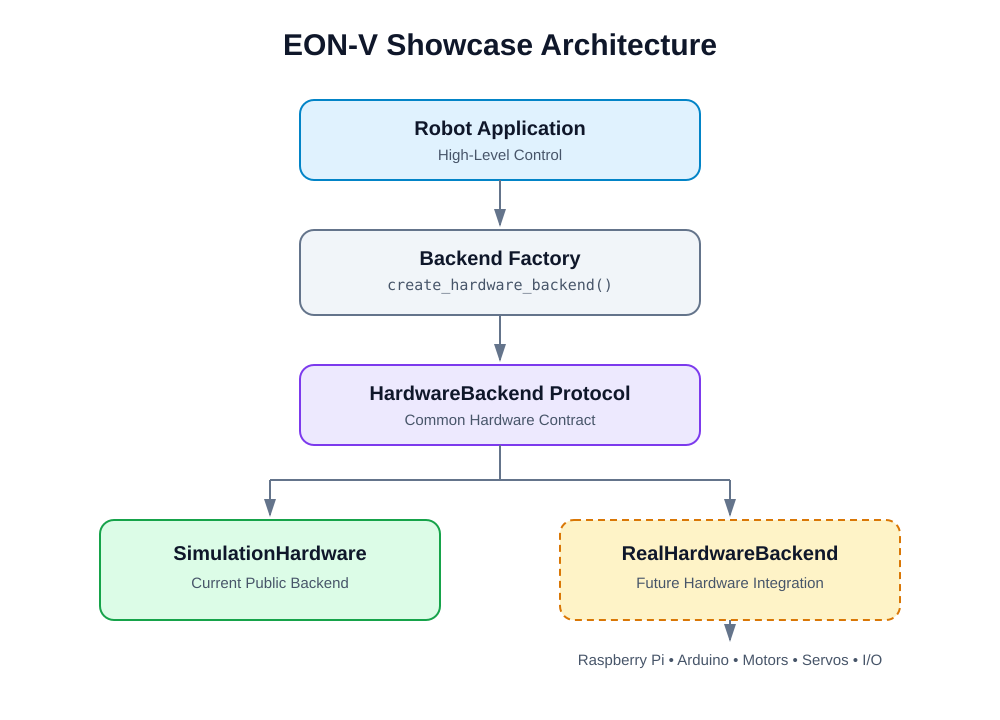

# EON-V Showcase
[](https://github.com/BrunoCAT23/EON-V-Showcase/actions/workflows/tests.yml)

EON-V is a personal AI robotics project focused on building a modular robot companion platform.

This repository is a public engineering showcase of selected EON-V components.  
The complete EON-V system and its proprietary AI/behavior architecture remain private.

## Project Goals

EON-V explores the integration of:

- Python robotics software
- Raspberry Pi
- Arduino
- Hardware abstraction
- Robot simulation
- Voice interaction
- Computer vision
- AI / LLM integration
- Modular robot behaviors
- Automated testing

## Key Features

- Hardware abstraction through a shared `HardwareBackend` protocol
- Software-based `SimulationHardware` backend for development without a physical robot
- Backend factory for selecting hardware implementations
- Simulated motor, servo, display, and speech operations
- Automated tests with `pytest`
- Continuous integration with GitHub Actions
- Runnable simulation demo
- Modular structure designed for future Raspberry Pi and Arduino integration

## Tech Stack

| Area | Technology |
| --- | --- |
| Language | Python 3.10+ |
| Architecture | Protocol-based hardware abstraction, backend factory |
| Simulation | Custom software hardware backend |
| Testing | pytest |
| CI | GitHub Actions |
| Version Control | Git, GitHub |
| Target Platforms | Raspberry Pi, Arduino |

## Architecture

EON-V Showcase uses a hardware abstraction layer to separate high-level robot software from physical hardware implementations.

The architecture currently includes:

- a common `HardwareBackend` protocol
- a software-based `SimulationHardware` backend
- a backend factory for selecting hardware implementations
- automated tests for hardware behavior and interface compatibility

This design allows robotics software to be developed and tested without requiring physical robot hardware.

For a detailed architecture overview, see:

<p align="center">
  
</p>

[Architecture Documentation](docs/architecture.md)

## Simulation Demo

The showcase includes a runnable simulation demonstrating the hardware abstraction architecture without requiring physical robot hardware.

The demo creates a simulated hardware backend and exercises robot hardware operations entirely in software.

It demonstrates:

- motor control
- servo positioning
- display output
- speech output
- backend creation through the hardware factory

Run from the repository root:

```bash
python -m examples.simulation_demo
```

Successful run:

    Simulation demo completed successfully.

## Quick Start

Clone the repository and install the development dependencies:

```bash
python -m pip install -r requirements-dev.txt
```

Run the simulation demo:

```bash
python -m examples.simulation_demo
```

Expected output:

```text
Simulation demo completed successfully.
```

## Running Tests

Run the complete automated test suite from the repository root:

```bash
python -m pytest -v
```

The tests validate:

- hardware backend interface compatibility
- simulated motor commands
- stop behavior
- servo state
- display state
- speech output
- backend factory behavior

## Repository Structure

```text
EON-V-Showcase/
├── hardware/
│   ├── backend_factory.py
│   └── simulation_hardware.py
├── hardware_interfaces/
│   └── hardware_backend.py
├── examples/
│   └── simulation_demo.py
├── tests/
│   ├── test_backend_factory.py
│   └── test_simulation_hardware.py
├── docs/
│   └── architecture.md
├── requirements-dev.txt
└── README.md
```

## Current Showcase Features

- Runtime-checkable hardware backend protocol
- Software-based robot hardware simulation
- Motor speed and stop simulation
- Servo position simulation
- Display frame simulation
- Speech output simulation
- Hardware backend factory
- Automated architecture and behavior tests
- Runnable simulation example
- Architecture documentation

## Roadmap

Planned public showcase extensions include:

- Raspberry Pi hardware backend
- Arduino communication layer
- Sensor abstraction
- asynchronous hardware events
- additional robotics examples

## Project Scope

This repository contains selected engineering components created to demonstrate the architecture and development approach behind EON-V.

The complete EON-V robot runtime, AI behavior system, memory architecture, personality system, and other proprietary components are not included in this public showcase.